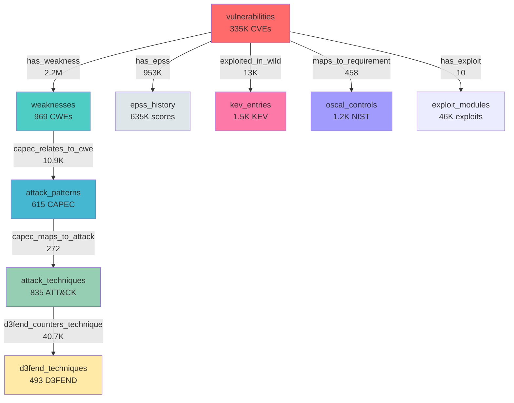

# Database Schema - Complira Graph

## Overview

**Database:** ArangoDB (Graph Database)
**Total Collections:** 66
**Total Documents:** ~6.4M
**Graph Structure:** Multi-layered threat intelligence graph

---

## 📊 Schema Statistics

### Document Collections (Node Types)

| Collection | Count | Description |
|-----------|-------|-------------|
| **vulnerabilities** | **335,504** | CVE vulnerability records from NVD |
| **has_weakness** | **2,199,297** | CVE → CWE mappings |
| **aliases** | **1,177,665** | CVE aliases and alternate IDs |
| **has_epss** | **953,602** | CVE → EPSS score edges |
| **epss_history** | **635,744** | Historical EPSS scores |
| **exploit_modules** | **46,491** | Metasploit/ExploitDB modules |
| **d3fend_counters_technique** | **40,722** | D3FEND → ATT&CK defensive mappings |
| **cpe_entries** | **35,940** | Common Platform Enumerations |
| **exploited_in_wild** | **13,805** | CVE → KEV catalog edges |
| **capec_relates_to_cwe** | **10,926** | CAPEC → CWE attack pattern mappings |
| **package_health** | **7,593** | Package health scores |
| **child_of** | **6,585** | CWE hierarchy relationships |
| **vulncheck_kev_entries** | **4,609** | VulnCheck KEV catalog |
| **capec_child_of** | **4,264** | CAPEC hierarchy |
| **kev_entries** | **1,529** | CISA KEV catalog |
| **scf_controls** | **1,451** | Secure Controls Framework |
| **oscal_controls** | **1,196** | NIST 800-53 controls (OSCAL) |
| **weaknesses** | **969** | CWE weakness types |
| **attack_techniques** | **835** | MITRE ATT&CK techniques |
| **licenses** | **727** | Software licenses |
| **can_precede** | **715** | Attack sequence relationships |
| **attack_patterns** | **615** | CAPEC attack patterns |
| **peer_of** | **490** | CWE peer relationships |
| **d3fend_techniques** | **493** | D3FEND defensive techniques |
| **maps_to_requirement** | **458** | CVE → Compliance mappings |
| **llm_enrichments** | **344** | LLM-generated enrichments |
| **capec_maps_to_attack** | **272** | CAPEC → ATT&CK mappings |
| **threat_groups** | **187** | APT groups and threat actors |
| **atlas_techniques** | **155** | MITRE ATLAS ML attack techniques |
| **atlas_maps_to_attack** | **170** | ATLAS → ATT&CK mappings |
| **requires** | **65** | CWE requirement dependencies |
| **regulatory_requirements** | **52** | Regulatory framework requirements |
| **vuln_triggers_requirement** | **43** | CVE → Regulatory triggers |
| **has_exploit** | **10** | CVE → Exploit module edges |
| **regulatory_frameworks** | **3** | Compliance frameworks |
| **agent_checkpoints** | **2** | Agent execution state |

---

## 🌐 Graph Visualization

### Core Graph Structure

```
┌─────────────────────────────────────────────────────────────────────┐
│                    COMPLIRA THREAT INTELLIGENCE GRAPH                │
└─────────────────────────────────────────────────────────────────────┘

                         ┌──────────────────┐
                         │  vulnerabilities │ ◄─── NVD API
                         │   (335,504 CVEs) │
                         └────────┬─────────┘
                                  │
            ┌─────────────────────┼─────────────────────┐
            │                     │                     │
            ▼                     ▼                     ▼
    ┌──────────────┐      ┌─────────────┐      ┌─────────────┐
    │ has_weakness │      │  has_epss   │      │exploited_in │
    │  (2.2M edges)│      │(953K edges) │      │ _wild (13K) │
    └──────┬───────┘      └──────┬──────┘      └──────┬──────┘
           │                     │                     │
           ▼                     ▼                     ▼
    ┌─────────────┐      ┌─────────────┐      ┌─────────────┐
    │ weaknesses  │      │epss_history │      │ kev_entries │
    │  (969 CWEs) │      │  (635K pts) │      │  (1,529)    │
    └──────┬──────┘      └─────────────┘      └─────────────┘
           │
           │ capec_relates_to_cwe
           │     (10,926 edges)
           ▼
    ┌─────────────┐
    │attack_      │ ◄───── capec_maps_to_attack ────┐
    │patterns     │             (272 edges)          │
    │ (615 CAPEC) │                                  │
    └─────────────┘                                  │
                                                     │
                 ┌───────────────────────────────────┘
                 │
                 ▼
    ┌──────────────────┐
    │ attack_techniques│ ◄─── atlas_maps_to_attack (170)
    │  (835 ATT&CK)    │
    └────────┬─────────┘
             │
             │ d3fend_counters_technique
             │      (40,722 edges)
             ▼
    ┌──────────────────┐
    │ d3fend_techniques│
    │    (493 D3FEND)  │
    └──────────────────┘


    ┌──────────────────┐
    │  vulnerabilities │
    └────────┬─────────┘
             │
             │ maps_to_requirement
             │      (458 edges)
             ▼
    ┌──────────────────┐
    │ oscal_controls   │
    │  (1,196 NIST)    │
    └──────────────────┘
```

---

## 🔗 Key Relationships (Edges)

### Primary Enrichment Path

```
CVE → CWE → CAPEC → ATT&CK → Threat Groups
 │      │      │       │
 │      │      │       └─► D3FEND Defenses
 │      │      │
 │      │      └─► Attack Patterns
 │      │
 │      └─► Weakness Taxonomy
 │
 ├─► EPSS Score (Exploitation Probability)
 ├─► KEV Catalog (Known Exploited)
 ├─► Exploit Modules (Metasploit, etc.)
 ├─► CPE Matches (Affected Products)
 └─► Compliance Controls (NIST, ISO, etc.)
```

### Detailed Edge Mappings

| Edge Collection | From → To | Count | Purpose |
|----------------|-----------|-------|---------|
| **has_weakness** | vulnerabilities → weaknesses | 2,199,297 | CVE to CWE mapping |
| **has_epss** | vulnerabilities → epss_history | 953,602 | Exploitation probability |
| **exploited_in_wild** | vulnerabilities → kev_entries | 13,805 | CISA KEV catalog |
| **d3fend_counters_technique** | d3fend_techniques → attack_techniques | 40,722 | Defensive countermeasures |
| **capec_relates_to_cwe** | attack_patterns → weaknesses | 10,926 | Attack pattern to weakness |
| **maps_to_requirement** | vulnerabilities → oscal_controls | 458 | Compliance mapping |
| **capec_maps_to_attack** | attack_patterns → attack_techniques | 272 | CAPEC to ATT&CK |
| **atlas_maps_to_attack** | atlas_techniques → attack_techniques | 170 | ML attacks to ATT&CK |
| **has_exploit** | vulnerabilities → exploit_modules | 10 | Public exploit availability |
| **child_of** | weaknesses → weaknesses | 6,585 | CWE hierarchy |
| **capec_child_of** | attack_patterns → attack_patterns | 4,264 | CAPEC hierarchy |
| **can_precede** | attack_techniques → attack_techniques | 715 | Attack sequence |
| **peer_of** | weaknesses → weaknesses | 490 | Related CWEs |
| **requires** | weaknesses → weaknesses | 65 | CWE dependencies |
| **vuln_triggers_requirement** | vulnerabilities → regulatory_requirements | 43 | Regulatory triggers |

---

## 📁 Collection Categories

### 1. Vulnerability Intelligence
- `vulnerabilities` - CVE records
- `aliases` - Alternate CVE IDs
- `cpe_entries` - Affected products
- `affects` - Product version ranges

### 2. Exploitation Metrics
- `epss_history` - EPSS scores over time
- `has_epss` - Current EPSS edges
- `kev_entries` - CISA KEV catalog
- `vulncheck_kev_entries` - VulnCheck KEV
- `exploited_in_wild` - KEV relationships
- `exploit_modules` - Metasploit/ExploitDB

### 3. Weakness & Attack Taxonomy
- `weaknesses` - CWE weakness types
- `attack_patterns` - CAPEC attack patterns
- `attack_techniques` - MITRE ATT&CK
- `atlas_techniques` - ML/AI attacks
- `child_of`, `peer_of` - CWE relationships
- `capec_child_of` - CAPEC hierarchy

### 4. Defensive Intelligence
- `d3fend_techniques` - Defensive techniques
- `d3fend_counters_technique` - ATT&CK countermeasures
- `oscal_controls` - NIST 800-53 controls
- `scf_controls` - Secure Controls Framework

### 5. Threat Intelligence
- `threat_groups` - APT groups
- `botnets` - Botnet families
- `ransomware_families` - Ransomware groups
- `exploit_chains` - Multi-stage attacks

### 6. Compliance & Regulatory
- `regulatory_frameworks` - Compliance frameworks
- `regulatory_requirements` - Specific requirements
- `maps_to_requirement` - CVE to compliance
- `vuln_triggers_requirement` - Regulatory triggers
- `cross_framework_mapping` - Framework alignment

### 7. Software Supply Chain
- `components` - Software components
- `dependencies` - Package dependencies
- `licenses` - Software licenses
- `package_health` - Health metrics
- `scorecard_results` - OpenSSF Scorecard
- `eol_products` - End-of-life status

### 8. System Collections
- `agent_checkpoints` - Ingestion state
- `llm_enrichments` - AI-generated analysis
- `customer_profiles` - Multi-tenancy

---

## 🎯 Query Patterns

### 1. CVE Enrichment (Phase 1)

```aql
// Get full CVE enrichment
FOR cve IN vulnerabilities
  FILTER cve._key == "CVE_2024_21413"

  LET epss = FIRST(
    FOR v, e, h IN 1..1 OUTBOUND cve has_epss
    SORT h.date DESC
    LIMIT 1
    RETURN h.epss
  )

  LET in_kev = LENGTH(
    FOR v, e, k IN 1..1 OUTBOUND cve exploited_in_wild
    RETURN k
  ) > 0

  LET cwes = (
    FOR v, e, w IN 1..1 OUTBOUND cve has_weakness
    RETURN w.cwe_id
  )

  RETURN {
    cve_id: cve._key,
    cvss: cve.cvss_v3_score,
    epss: epss,
    in_kev: in_kev,
    cwes: cwes
  }
```

### 2. Attack Path Traversal

```aql
// CVE → CWE → CAPEC → ATT&CK → D3FEND
FOR cve IN vulnerabilities
  FILTER cve._key == "CVE_2024_21413"

  FOR v1, e1, cwe IN 1..1 OUTBOUND cve has_weakness
    FOR v2, e2, capec IN 1..1 INBOUND cwe capec_relates_to_cwe
      FOR v3, e3, attack IN 1..1 OUTBOUND capec capec_maps_to_attack
        FOR v4, e4, d3fend IN 1..1 INBOUND attack d3fend_counters_technique

        RETURN {
          cve: cve._key,
          cwe: cwe.cwe_id,
          capec: capec.capec_id,
          attack: attack.technique_id,
          defense: d3fend.d3fend_id
        }
```

### 3. Compliance Mapping

```aql
// Find applicable NIST controls
FOR cve IN vulnerabilities
  FILTER cve._key == "CVE_2024_21413"

  FOR v, e, control IN 1..1 OUTBOUND cve maps_to_requirement

  RETURN {
    cve: cve._key,
    control: control.control_id,
    family: control.family,
    title: control.title
  }
```

---

## 💾 Storage Statistics

| Category | Collections | Documents | Percentage |
|----------|------------|-----------|------------|
| **Vulnerabilities** | 1 | 335,504 | 5.2% |
| **CVE Relationships** | 4 | 3,166,704 | 49.5% |
| **Weaknesses/Attacks** | 3 | 2,419 | 0.04% |
| **Defensive Intel** | 2 | 1,689 | 0.03% |
| **Threat Intel** | 3 | 187 | 0.003% |
| **Exploitation Data** | 4 | 1,635,261 | 25.6% |
| **Compliance** | 4 | 1,707 | 0.03% |
| **Other** | 45 | 1,254,893 | 19.6% |
| **TOTAL** | **66** | **~6.4M** | **100%** |

---

## 🔄 Data Refresh Schedule

| Data Source | Collection | Update Frequency | Method |
|------------|-----------|------------------|--------|
| **NVD CVEs** | vulnerabilities | Weekly | NVD API 2.0 |
| **EPSS Scores** | epss_history | Daily | FIRST.org CSV |
| **CISA KEV** | kev_entries | Daily | CISA JSON |
| **CWE** | weaknesses | Monthly | MITRE XML |
| **CAPEC** | attack_patterns | Monthly | MITRE XML |
| **ATT&CK** | attack_techniques | Monthly | MITRE JSON |
| **D3FEND** | d3fend_techniques | Quarterly | MITRE OWL |
| **NIST 800-53** | oscal_controls | Quarterly | OSCAL JSON |
| **Exploits** | exploit_modules | Weekly | ExploitDB/Metasploit |

---

## 🎨 Graph Diagram (Mermaid)



---

## 📈 Growth Projections

**Current:** 6.4M documents
**Weekly Growth:** ~5K new CVEs, ~50K new relationships
**Annual Growth:** ~260K CVEs, ~2.6M relationships

**Estimated Storage:**
- Current: ~8 GB
- 1 Year: ~15 GB
- 3 Years: ~30 GB

---

## 🔍 Index Strategy

**Primary Indexes:**
- `vulnerabilities._key` (CVE ID)
- `weaknesses.cwe_id`
- `attack_techniques.technique_id`
- `epss_history.date`
- `kev_entries.cve_id`

**Composite Indexes:**
- `vulnerabilities.[cvss_v3_score, published]`
- `epss_history.[cve_id, date]`

---

**Last Updated:** 2026-03-06
**Schema Version:** 1.0 (Phase 1 Complete)
